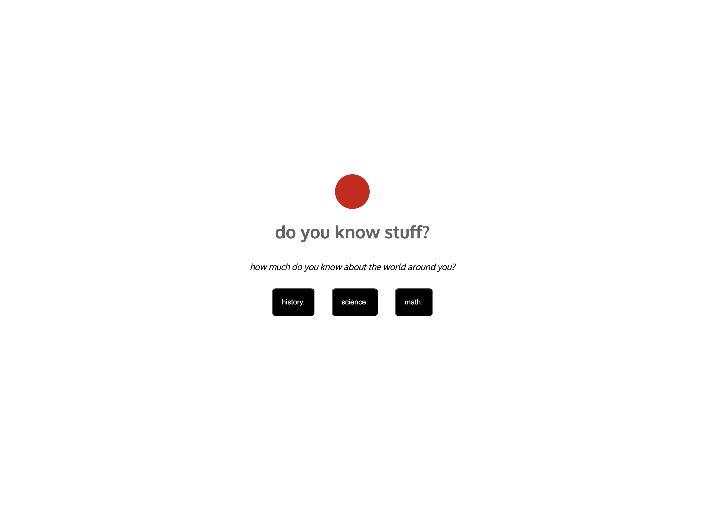

# Do you know stuff?
Welcome to my first project as a software developer. As a former teacher, its only proper that this first project is a Quiz Game! This Quiz Game called **Do you know stuff** where we test you on simple facts in ***Math, Science*** and ***History***.

I developed this game as my first project in General Assembly's Sotware engineering bootcamp using **HTML, CSS** and **Javascript**. I enjoyed getting to understand more about game logic, javascript functions and scope flow. 

## Project Planning
> As I was planning my app I used Canva to design my wireframe. You can see visuals of my process [here](https://www.canva.com/design/DAGMtX_pUmo/5qssgPZYvx8x1WKMbFvqhQ/view?utm_content=DAGMtX_pUmo&utm_campaign=designshare&utm_medium=link&utm_source=editor)

> I needed alot of questions quickly so I used **CHATGPT** to acquire sets of questions and answers. 

> Jim, my pod leader here at **General Assembly** also assisted me with pseudocode to think about the logic of my game. From the foundational logic given, I created the game logic I will discuss to you all. 

## How to play
To start the game, ***click*** any of the categories below that youd like to start with. There are 5 questions in our History and Science categories and 6 questions in our Math category. The goal is to get a total of at least **12 points** because 12 points out of 16 points gives us a passing percentage of **75%**. 

Once you click a category, a random question from that category will appear. If you get the answer wrong, the correct answer will be displayed at the bottom of the screen and you will not earn a point. If you got the question correct, you will see a message ***Good Job*** and an addition of one point. Your points are tracked at the top of the screen in a red circle that will appear once the game is in progress. Good luck.

## Live Demo
You can play my first ever game creation **Do you know stuff?** [here](https://ayodeleowolabi.github.io/quizgame/)

### Screenshot
