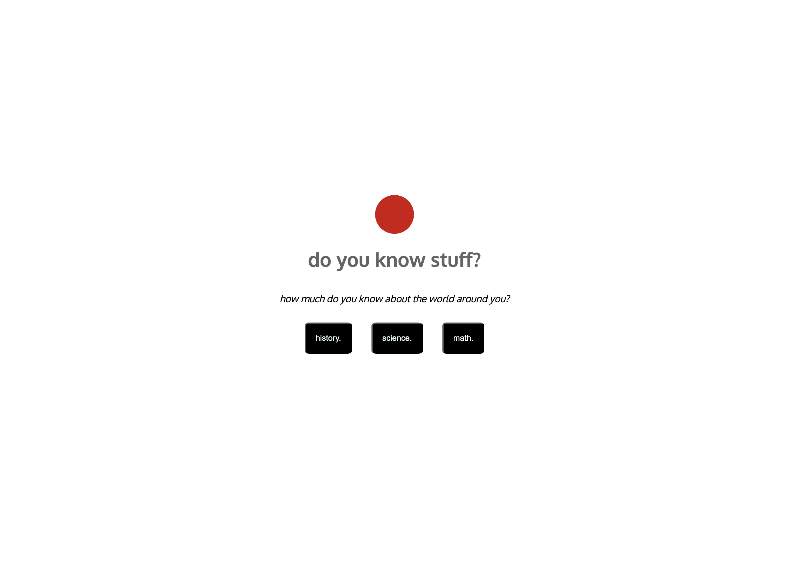

# Do You Know Stuff? Quiz Game + Playwright Test Suite

[](https://github.com/ayodeleowolabi/quizgame/actions/workflows/playwright.yml)

**Play it:** [ayodeleowolabi.github.io/quizgame](https://ayodeleowolabi.github.io/quizgame/)

A browser trivia game with Math, Science and History categories. I built it as my first project in General Assembly's Software Engineering Immersive. Later I came back and added an **end-to-end test suite with Playwright** that runs in **GitHub Actions CI** on every push and pull request.



## How to play

Pick a category and you'll get a random question from it. A correct answer earns one point, and a wrong answer shows you the correct one. There are 16 questions in all, and a score of **12 or more (75%)** wins.

## Test automation

`tests/quizgame.spec.js` contains **11 end-to-end tests** covering the game's main flows and business rules:

| Area | What's verified |
|---|---|
| Initial state | Categories are visible, answers are hidden, instructions are shown |
| Question flow | Picking a category shows a question with four non-empty answers |
| Feedback | A correct answer shows the point-earned message; a wrong answer reveals the correct answer |
| State reset | After each answer, the UI goes back to category selection |
| Scoring | +1 on a correct answer, no change on a wrong one, and the score adds up correctly across rounds |
| Exhaustion | A category button disappears once all its questions have been used |
| End states | The win message appears at 12+; the lose message appears below that, and **Play Again** fully resets the game |

**Setup highlights** (`playwright.config.js`):

- Starts a local `http-server` automatically through `webServer`.
- Runs tests in parallel locally, with a single worker and **2 retries in CI**.
- Records traces on the first retry, which helps debug flaky tests.
- `forbidOnly` in CI, so a stray `test.only` can't get merged.
- Produces an HTML report that CI uploads as a build artifact (kept for 14 days).

### Run the tests

```bash
npm install
npx playwright install chromium
npm test              # headless run
npm run test:ui       # interactive UI mode
npm run test:report   # open the last HTML report
```

## Tech stack

- **App:** HTML, CSS, vanilla JavaScript
- **Testing:** Playwright Test (Chromium)
- **CI:** GitHub Actions (`.github/workflows/playwright.yml`)

## Project planning

- Wireframes were designed in [Canva](https://www.canva.com/design/DAGMtX_pUmo/5qssgPZYvx8x1WKMbFvqhQ/view).
- I used ChatGPT to quickly generate question-and-answer sets.
- Thanks to Jim, my General Assembly instructor, for pseudocode help with the game logic.

---
Built by **Ayodele Owolabi**
